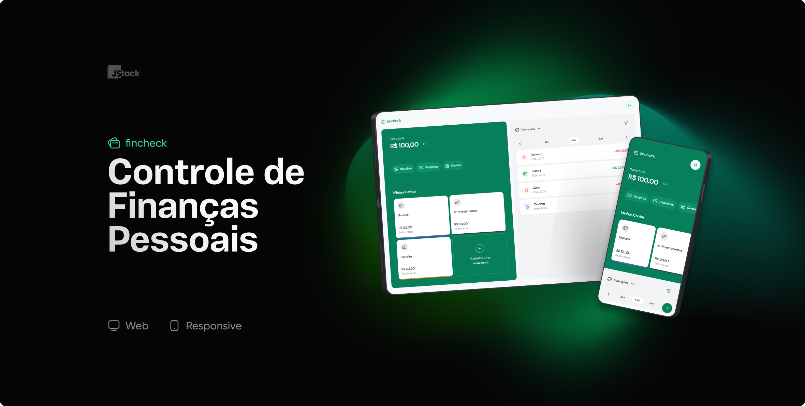

<h1 align="center">
  
</h1>
<p align="center">
  
</p>

## Technologies


## 📂 Description
It's a personal finance management app. After logging into your account using a registered email and password, you can utilize features such as registering bank accounts and 
adding monthly expenses and incomes. Additionally, you can filter transactions by month, year, bank account, and transaction type (income or expense). 
Accessible via the web on both mobile devices and computers.


## Running the app

#### Clone

```bash
git clone https://github.com/Micalli/Fincheck-V1.git && cd Fincheck-V1
```

#### Install dependencies

[Node.js](https://nodejs.org/) is required to install dependencies and run the project.

### Back-end
```bash
cd api/
yarn 
```


### Front-end
```bash
cd frontend/
yarn 
```

#### Run PostgreSQL with Docker

The database can be launched locally with a [Docker Container](https://www.docker.com/resources/what-container/).

Check the official documentation to install the [Docker Engine](https://docs.docker.com/engine/install/ubuntu/).

```bash
docker run --name pg -e POSTGRES_USER=root -e POSTGRES_PASSWORD=root -p 5432:5432 -d postgres
```

#### Setup environment variables

Fill the .env variables (In .env.example you can see them)

#### Running the back end

```bash
cd api && yarn start:dev
```

#### Running the front end

```bash
cd frontend && yarn dev
```

## Stay in touch
Feito com :green_heart: por [Bruno Micalli](https://github.com/micalli).


[](https://www.linkedin.com/in/brunomicalli/)
